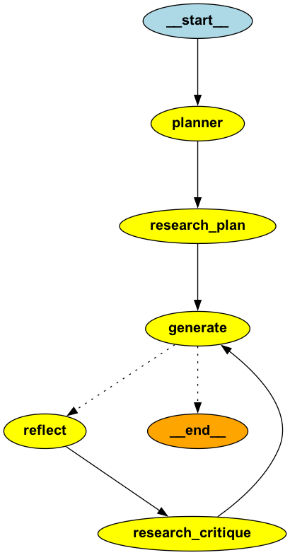

[![Contributors][contributors-shield]][contributors-url]
[![Issues][issues-shield]][issues-url]
[![MIT License][license-shield]][license-url]
[![LinkedIn][linkedin-shield]][linkedin-url]
<!-- [![Forks][forks-shield]][forks-url]
[![Stargazers][stars-shield]][stars-url] -->

<!-- PROJECT LOGO -->
 

  <h2 align="center">AgentWrite</h2>

  

    AI-Powered Multi-Agent System for Automated Essay Writing
     
    <small>Made with ❤️ by Deep Rodge</small> 
    <!-- <a href="https://github.com/deeprodge/AgentWrite"><strong>Explore the docs »</strong></a>
     
     
    <a href="https://github.com/deeprodge/AgentWrite">View Demo</a>
    · -->
    <a href="https://github.com/deeprodge/AgentWrite/issues">Report Bug</a>
    ·
    <a href="https://github.com/deeprodge/AgentWrite/issues">Request Feature</a>
  

<!-- TABLE OF CONTENTS -->

  
Table of Contents

  <ol>
    <li>
      <a href="#about-the-project">About The Project</a>
      <ul>
        <li><a href="#key-features">Key Features</a></li>
        <li><a href="#system-architecture">System Architecture</a></li>
        <li><a href="#workflow">Workflow</a></li>
        <li><a href="#built-with">Built With</a></li>
      </ul>
    </li>
    <li><a href="#contributing">Contributing</a></li>
    <!-- <li><a href="#license">License</a></li> -->
    <li><a href="#contact">Contact</a></li>
  </ol>

<!-- ABOUT THE PROJECT -->
## About The Project
 

AgentWrite is a sophisticated multi-agent system designed for automated essay writing. It leverages advanced AI technologies to create comprehensive, well-researched essays on given topics through an automated, iterative process.  

### Key Features

- <b>Multi-Agent Architecture</b>: Utilizes a modular system with specialized agents for different tasks.
- <b>AI-Powered Writing</b>: Employs OpenAI's GPT-3.5-turbo model for essay planning, writing, and critiquing.
- <b>Automated Research</b>: Integrates Tavily API for efficient online research.
- <b>Iterative Improvement</b>: Implements an AI-driven feedback loop for continuous essay refinement.
- <b>Complex Workflow Management</b>: Uses langgraph for orchestrating intricate agent interactions.

(<a href="#top">back to top</a>)

### System Architecture
The system is composed of several modular components:
- <b>Planning Node</b>: Outlines the essay structure and main points.
- <b>Research Node</b>: Gathers relevant information using Tavily API.
- <b>Essay Generation Node</b>: Produces the initial draft using GPT-3.5-turbo.
- <b>Reflection and Critique Node</b>: Analyzes and provides feedback on the essay.

 

  

 

(<a href="#top">back to top</a>)

### Workflow
1. Initial topic research
2. Essay planning
3. Draft generation
4. AI-powered reflection and critique
5. Rewriting and refinement
6. Repeat steps 4-5 until satisfactory results are achieved

(<a href="#top">back to top</a>)

### Built With

* [Python](https://www.python.org/)
* [LangGraph](https://langchain-ai.github.io/langgraph/)
* [LangChain](https://python.langchain.com/docs/introduction/)
* [OpenAI](https://openai.com/)
* [Tavily](https://tavily.com/)

(<a href="#top">back to top</a>)

<!-- CONTRIBUTING -->
## Contributing

Contributions are what make the open source community such an amazing place to learn, inspire, and create. Any contributions you make are **greatly appreciated**.

If you have a suggestion that would make this better, please fork the repo and create a pull request. You can also simply open an issue with the tag "enhancement".
Don't forget to give the project a star! Thanks again!

1. Fork the Project
2. Create your Feature Branch (`git checkout -b feature/AmazingFeature`)
3. Commit your Changes (`git commit -m 'Add some AmazingFeature'`)
4. Push to the Branch (`git push origin feature/AmazingFeature`)
5. Open a Pull Request

(<a href="#top">back to top</a>)

<!-- CONTACT -->
## Contact

Deep Rodge - [LinkedIn](https://linkedin.com/in/deeprodge) - deeprodge14@gmail.com

Project Link: [https://github.com/deeprodge/AgentWrite](https://github.com/deeprodge/AgentWrite)

(<a href="#top">back to top</a>)

<!-- MARKDOWN LINKS & IMAGES -->
<!-- https://www.markdownguide.org/basic-syntax/#reference-style-links -->
[contributors-shield]: https://img.shields.io/github/contributors/deeprodge/AgentWrite
[contributors-url]: https://github.com/deeprodge/AgentWrite/graphs/contributors
[forks-shield]: https://img.shields.io/github/forks/deeprodge/AgentWrite.svg?style=for-the-badge
[forks-url]: https://github.com/deeprodge/AgentWrite/network/members
[stars-shield]: https://img.shields.io/github/stars/deeprodge/AgentWrite.svg?style=for-the-badge
[stars-url]: https://github.com/deeprodge/AgentWrite/stargazers
[issues-shield]: https://img.shields.io/github/issues/deeprodge/AgentWrite.svg?style=for-the-badge
[issues-url]: https://github.com/deeprodge/AgentWrite/issues
[license-shield]: https://img.shields.io/github/license/deeprodge/AgentWrite.svg?style=for-the-badge
[license-url]: https://github.com/deeprodge/AgentWrite/blob/main/LICENSE
[linkedin-shield]: https://img.shields.io/badge/-LinkedIn-black.svg?style=for-the-badge&logo=linkedin&colorB=555
[linkedin-url]: https://linkedin.com/in/deeprodge
[product-screenshot]: images/screenshot.png
