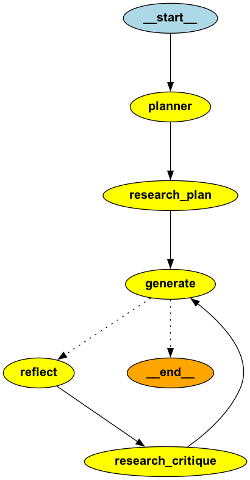

[![Contributors][contributors-shield]][contributors-url]
[![Issues][issues-shield]][issues-url]
[![MIT License][license-shield]][license-url]
[![LinkedIn][linkedin-shield]][linkedin-url]

 

  <h2 align="center">AgentWrite: Autonomous Content Pipeline</h2>

  

    An Autonomous, Multi-Agent System for SEO-Optimized Content Generation
     
    <small>Made with ❤️ by Deep Rodge</small> 
    <a href="https://github.com/deeprodge/AgentWrite/issues">Report Bug</a>
    ·
    <a href="https://github.com/deeprodge/AgentWrite/issues">Request Feature</a>
  

  
Table of Contents

  <ol>
    <li>
      <a href="#about-the-project">About The Project</a>
      <ul>
        <li><a href="#key-features">Key Features</a></li>
        <li><a href="#system-architecture">System Architecture</a></li>
        <li><a href="#workflow">Workflow</a></li>
        <li><a href="#built-with">Built With</a></li>
      </ul>
    </li>
    <li><a href="#contributing">Contributing</a></li>
    <li><a href="#contact">Contact</a></li>
  </ol>

## About The Project
 

AgentWrite is an autonomous content generation pipeline designed to address the challenges of scaling content marketing. It mimics the workflow of a professional SEO and content creation team by using a collaborative multi-agent system to research, draft, and refine high-quality, SEO-optimized articles.

This project moves beyond simple text generation by creating a strategic system where AI agents collaborate to produce content that is not only well-written but also engineered to rank on search engines.

### Key Features

- <b>Multi-Agent Collaboration</b>: Utilizes a modular system where specialized agents collaborate on content strategy, research, and creation.
- <b>Strategic Content Creation</b>: Employs LLMs (GPT-3.5-turbo) for drafting content that is strategically aligned with SEO goals.
- <b>Real-Time Market Research</b>: Integrates the Tavily API to perform real-time analysis of Search Engine Results Pages (SERPs).
- <b>Automated Quality Assurance</b>: Implements an AI-driven feedback loop where a "Critique Agent" acts as an editor, ensuring content meets quality and SEO standards.
- <b>Cyclical Workflow Management</b>: Uses LangGraph to orchestrate the sophisticated, iterative interactions between agents as shown in the architecture.

(<a href="#top">back to top</a>)

### System Architecture
The system is built on a directed acyclic graph (DAG) managed by LangGraph, where each node represents a specialized agent performing a distinct task.

 

  

 

-   **Planner Node**: Acts as the **SEO Strategist**. It receives the initial topic and creates a high-level content plan, outlining the structure and key points required to rank.
-   **Research Plan Node**: Takes the strategic outline and formulates a detailed research plan, generating specific search queries to gather data on competitor articles and authoritative sources via the Tavily API.
-   **Generate Node**: Functions as the **Content Drafter**. It executes the research plan, synthesizes the gathered information, and writes the initial draft of the article.
-   **Reflect & Research Critique Nodes**: These nodes form the **Automated Quality Assurance** loop. The `reflect` node performs a self-correction check, while the `research_critique` node conducts a formal audit against SEO best practices, generating actionable feedback.

(<a href="#top">back to top</a>)

### Workflow
The content generation process directly follows the flow of the architecture graph:

1.  **Planning**: The process starts at the `__start__` node and moves to the **Planner**, which creates a strategic content outline.
2.  **Research Strategy**: The **Research Plan** node translates this outline into actionable search queries.
3.  **Draft Generation**: The **Generate** node executes the research and writes the first draft.
4.  **Audit & Critique**: The draft is passed to the **Reflect** and **Research Critique** nodes, which audit it for quality and SEO compliance.
5.  **Iterative Refinement**: The actionable feedback from the critique is fed back to the **Generate** node, which rewrites the draft to incorporate the suggestions.
6.  **Completion**: This cycle of generation and critique continues until the article meets a predefined quality standard, at which point the graph transitions to the `__end__` node.

(<a href="#top">back to top</a>)

### Built With

* [Python](https://www.python.org/)
* [LangGraph](https://langchain-ai.github.io/langgraph/)
* [LangChain](https://python.langchain.com/docs/introduction/)
* [OpenAI](https://openai.com/)
* [Tavily](https://tavily.com/)

(<a href="#top">back to top</a>)

## Contributing

Contributions are what make the open source community such an amazing place to learn, inspire, and create. Any contributions you make are **greatly appreciated**.

If you have a suggestion that would make this better, please fork the repo and create a pull request. You can also simply open an issue with the tag "enhancement".
Don't forget to give the project a star! Thanks again!

1. Fork the Project
2. Create your Feature Branch (`git checkout -b feature/AmazingFeature`)
3. Commit your Changes (`git commit -m 'Add some AmazingFeature'`)
4. Push to the Branch (`git push origin feature/AmazingFeature`)
5. Open a Pull Request

(<a href="#top">back to top</a>)

## Contact

Deep Rodge - [LinkedIn](https://linkedin.com/in/deeprodge) - deeprodge14@gmail.com

Project Link: [https://github.com/deeprodge/AgentWrite](https://github.com/deeprodge/AgentWrite)

(<a href="#top">back to top</a>)

[contributors-shield]: https://img.shields.io/github/contributors/deeprodge/AgentWrite
[contributors-url]: https://github.com/deeprodge/AgentWrite/graphs/contributors
[issues-shield]: https://img.shields.io/github/issues/deeprodge/AgentWrite.svg?style=for-the-badge
[issues-url]: https://github.com/deeprodge/AgentWrite/issues
[license-shield]: https://img.shields.io/github/license/deeprodge/AgentWrite.svg?style=for-the-badge
[license-url]: https://github.com/deeprodge/AgentWrite/blob/main/LICENSE
[linkedin-shield]: https://img.shields.io/badge/-LinkedIn-black.svg?style=for-the-badge&logo=linkedin&colorB=555
[linkedin-url]: https://linkedin.com/in/deeprodge